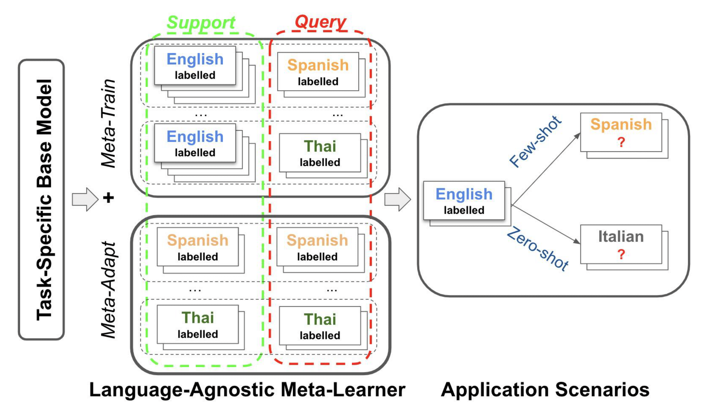

# Meta-Transfer Learning for X-NLU:

This is a pytorch/learn2learn implementation for cross-lingual Transfer Learning NLU using different techniques of meta-learning. This repository contains code for replicating experiments for task-oriented dialogue and typologically diverse question answering using meta-learning algorithms described in this paper: "[X-METRA-ADA: Cross-lingual Meta-Transfer Learning Adaptation to Natural Language Understanding and Question Answering](https://aclanthology.org/2021.naacl-main.283.pdf)" (M'hamdi et al. 2021) published at NAACL 2021.    
N.B.: The repository is still being organized/refactored. If you have questions or comments, feel free to send an email to mmhamdi at usc.edu.

## Table of Contents:

1. [Abstract](#abstract)
2. [Requirements](#requirements)
3. [Datasets](#datasets)
4. [Cross-lingual Few-shot Meta Pseudo-Tasks](#metatasks)
5. [Meta-learning on Multilingual Task-Oriented Dialogue (MTOD)](#mtod)
6. [Meta-learning on Few-Shot TyDiQA](#qa)
7. [Citation](#citation)
8. [Credits](#credits)


## 1. Abstract <a name="abstract"></a>:

Multilingual models, such as M-BERT and XLM-R, have gained increasing popularity, due to their zero-shot cross-lingual transfer learning capabilities. However, their generalization ability is still inconsistent for typologically diverse languages and across different benchmarks. Recently, meta-learning has garnered attention as a promising technique for enhancing transfer-learning under low-resource scenarios: particularly for cross-lingual transfer in Natural Language Understanding (NLU).

In this work, we propose **X-METRA-ADA**, a **cross**-lingual **ME**ta-**TRA**nsfer learning **ADA**ptation approach for NLU. Our approach adapts MAML, an optimization-based meta-learning approach, to learn an adaptation to new languages. This adaptation is different from standard fine-tuning moving towards a more principled few-shot learning setup. We extensively evaluate our framework on two challenging cross-lingual NLU tasks: multilingual task-oriented dialog and typologically diverse question answering. We show how our approach outperforms supervised fine-tuning, reaching competitive performance on both tasks for most languages. Our analysis reveals that X-METRA-ADA can leverage limited data for a faster adaptation.



## 2. Requirements <a name="requirements"></a>:

* Python 3.6 or higher.
* Depending on the task, you will need different requirements (and different package versions sometimes). For MTOD, run scripts: sh nlu/requirements_mtod.sh
* As there is a dependency conflict between version of transformers that we used to comply with XTREME and the one required by sentence-transformers, we use two different scripts requiring different requirements:
    * sh qa/requirements_sim_qa.sh: to pre-compute the matrix of similarities between the support and query matrices
    * sh qa/requirements_qa.sh: for the full script (using pre-computed similarities). 

## 3. Preparing/Loading the dataset <a name="datasets"></a>:
This code works for both public Facebook NLU dataset obtained using the same processing as [mixed-language-training](https://github.com/zliucr/mixed-language-training/tree/master/data/nlu/nlu_data). Download the data and
point --data-dir flag in pre_train_base.py and main.py towards their root directory containing the splits per language. 
If working with Facebook NLU dataset use tsv as --data-format, otherwise use json. The preprocessor will automatically
know how to handle each dataset type.

For TyDiQA, please follow instructions in [XTREME](https://github.com/google-research/xtreme) to obtain the train and test splits. We also provide [here](https://drive.google.com/drive/folders/1NcYIU62QhsImxOzzgL3zK3PRWN28pZZz?usp=sharing) our further splitting of the train into 90:train for high-resource and 10:dev for low-resource settings. 
## 4. Cross-lingual Few-shot Meta Pseudo-Tasks<a name="metatasks"></a>:
For details on how the support and query sets are sampled to generate pseudo-labelled tasks, please refer to nlu/meta_reader.py which creates training and adaptation batches of tasks. 

For details on how the support and query sets are generated for the meta-train and meta-adapt datasets, please refer to qa/pre_compute_similarities.py which relies on functions like find_similarities_query_spt in qa/data_utils.py. You can find, in the same link shared above, our pseudo meta-tasks splits for meta-train and meta-adapt for X-METRA-ADA saved as pickle files.

 
## 5. Training Multilingual Task-Oriented Dialogue (MTOD) <a name="mtod"></a>:
1) Initializing the parameters \theta_{0}:
    * PRE: Fine-tuning of the joint NLU Transformer model on English Train:
        * Offline: 
        ```
        python main_pre_en.py --train --train-langs en --test-langs en es th --use-slots --data-format "tsv"
                                 --trans-model "BertBaseMultilingualCased" --data-dir "Facebook-NLU-Data/"
                                 --out-dir "out" --pre-train-steps 2000 --batch-size 32 --adam-lr 4e-5
                                 --adam-eps 1e-08 
        ```
        * As a part of the whole meta-learning or target language fine-tuning pipeline:
        run main.py which automatically calls main_pre_en functionalities for training and evaluation and to that 
        effect run main.py without setting --use-pretrained-model flag
        
    * Use of saved pre-trained model for NLU:
    In this case, add --use-pretrained-model flag to main.py and provide the path to the binary pytorch file 
    --pre-trained-model-name (see step 2 below)  
    
    
2) Training X-METRA-ADA:
    * Few-shot learning on Spanish, Zero-shot on Thai:
    ```
    python main.py --option "META"  --use-slots --train-langs en --dev-langs th --test-langs en es th \
               --k-spt 6 --q-qry 6 --data-dir "Facebook-NLU-Data/" --out-dir "Results/few_shot_es/" --batch-sz 2500 --pre-train-steps 2000 --local_rank 0 \
               --use-pretrained-model "pre_trained" --pre-trained-model-name $pre_trained_model_name --seed 42
    ```
   
    * Zero-shot learning on Spanish, Few-shot on Thai:
    ```
    python main.py --option "META" --use-slots --train-langs en --dev-langs th --test-langs en es th --use-adapt --use-back --use-non-overlap \
               --k-spt 6 --q-qry 6 --data-dir "Facebook-NLU-Data/" --out-dir "Results/few_shot_th/ --batch-sz 2500 --pre-train-steps 2000 --local_rank 0 \
               --use-pretrained-model "pre_trained" --pre-trained-model-name $pre_trained_model_name --seed 42      
    ```
    

 Refer to nlu/scripts folder for a comprehensive list of experiments.


 ## 6. Training Multilingual Task-Oriented Dialogue (QA):
 
Refer to qa/scripts folder for a comprehensive list of experiments.

## 7. Citation<a name="citation"></a>:
<pre>
@inproceedings{mhamdi-etal-2021-x,
    title = "{X}-{METRA}-{ADA}: Cross-lingual Meta-Transfer learning Adaptation to Natural Language Understanding and Question Answering",
    author = "M{'}hamdi, Meryem  and
      Kim, Doo Soon  and
      Dernoncourt, Franck  and
      Bui, Trung  and
      Ren, Xiang  and
      May, Jonathan",
    booktitle = "Proceedings of the 2021 Conference of the North American Chapter of the Association for Computational Linguistics: Human Language Technologies",
    month = jun,
    year = "2021",
    address = "Online",
    publisher = "Association for Computational Linguistics",
    url = "https://aclanthology.org/2021.naacl-main.283",
    doi = "10.18653/v1/2021.naacl-main.283",
    pages = "3617--3632",
    abstract = "Multilingual models, such as M-BERT and XLM-R, have gained increasing popularity, due to their zero-shot cross-lingual transfer learning capabilities. However, their generalization ability is still inconsistent for typologically diverse languages and across different benchmarks. Recently, meta-learning has garnered attention as a promising technique for enhancing transfer learning under low-resource scenarios: particularly for cross-lingual transfer in Natural Language Understanding (NLU). In this work, we propose X-METRA-ADA, a cross-lingual MEta-TRAnsfer learning ADAptation approach for NLU. Our approach adapts MAML, an optimization-based meta-learning approach, to learn to adapt to new languages. We extensively evaluate our framework on two challenging cross-lingual NLU tasks: multilingual task-oriented dialog and typologically diverse question answering. We show that our approach outperforms naive fine-tuning, reaching competitive performance on both tasks for most languages. Our analysis reveals that X-METRA-ADA can leverage limited data for faster adaptation.",
}
</pre>

## 8. Credits<a name="credits"></a>
The code in this repository is partially based on: [mixed-language-training](https://github.com/zliucr/mixed-language-training) for the task-oriented dataset and cleaning code, [XTREME](https://github.com/google-research/xtreme) for base models, datasets and processing of TyDiQA, and [learn2learn](https://github.com/learnables/learn2learn) for X-METRA-ADA algorithm
 
