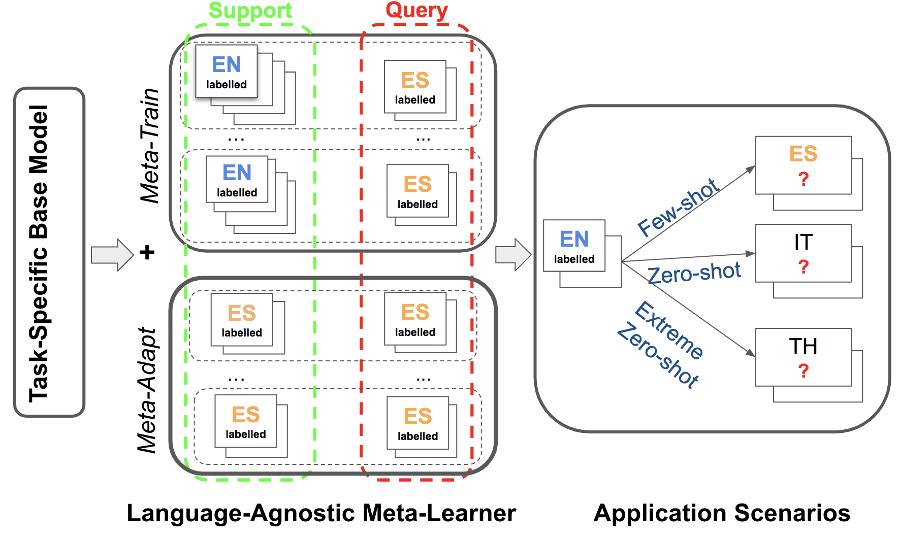

# Meta-Transfer Learning for X-NLU:

This is a pytorch/learn2learn implementation for cross-lingual Transfer Learning NLU using different techniques of meta-learning. This repository contains code for replicating experiments for task-oriented dialogue and typologically diverse question answering using meta-learning algorithms described in this paper: "X-METRA-ADA: Cross-lingual Meta-Transfer Learning Adaptation to Natural Language Understanding and Question Answering (M'hamdi et al. 2021)" to appear in NAACL'21.    

## Table of Contents:

1. [Abstract](#abstract)
2. [Requirements](#requirements)
3. [Datasets](#datasets)
4. [Cross-lingual Few-shot Meta Pseudo-Tasks](#metatasks)
5. [Meta-learning on Multilingual Task-Oriented Dialogue (MTOD)](#mtod)
6. [Meta-learning on Few-Shot TyDiQA](#qa)
7. [Other Models](#other)
8. [Citation](#citation)
9. [Credits](#credits)


## 1. Abstract <a name="abstract"></a>:

Multilingual models, such as M-BERT and XLM-R, have gained increasing popularity, due to their zero-shot cross-lingual transfer learning capabilities. However, their generalization ability is still inconsistent for typologically diverse languages and across different benchmarks. Recently, meta-learning has garnered attention as a promising technique for enhancing transfer-learning under low-resource scenarios: particularly for cross-lingual transfer in Natural Language Understanding (NLU).

In this work, we propose **X-METRA-ADA**, a **cross**-lingual **ME**ta-**TRA**nsfer learning **ADA**ptation approach for NLU. Our approach adapts MAML, an optimization-based meta-learning approach, to learn an adaptation to new languages. This adaptation is different from standard fine-tuning moving towards a more principled few-shot learning setup. We extensively evaluate our framework on two challenging cross-lingual NLU tasks: multilingual task-oriented dialog and typologically diverse question answering. We show how our approach outperforms supervised fine-tuning, reaching competitive performance on both tasks for most languages. Our analysis reveals that X-METRA-ADA can leverage limited data for a faster adaptation.



## 2. Requirements <a name="requirements"></a>:

* Python 3.6 or higher.
* Depending on the task, you will need different requirements (and different package versions sometimes). For MTOD, run scripts: sh nlu/requirements_mtod.sh
* As there is a dependency conflict between version of transformers that we used to comply with XTREME and the one required by sentence-transformers, we use two different scripts requiring different requirements:
    * sh qa/requirements_sim_qa.sh: to pre-compute the matrix of similarities between the support and query matrices
    * sh qa/requirements_qa.sh: for the full script (using pre-computed similarities). 

## 3. Preparing/Loading the dataset <a name="datasets"></a>:
This code works for both public Facebook NLU dataset obtained using the same processing as [mixed-language-training](https://github.com/zliucr/mixed-language-training/tree/master/data/nlu/nlu_data) 
and [Jarvis Adobe Intent dataset](https://git.corp.adobe.com/mhamdi/jarvis-multilingual/tree/meryem/data). Download them and
point --data-dir flag in pre_train_base.py and main.py towards their root directory containing the splits per language. 
If working with Facebook NLU dataset use tsv as --data-format, otherwise use json. The preprocessor will automatically
know how to handle each dataset type.

For TyDiQA, please follow instructions in [XTREME](https://github.com/google-research/xtreme) to obtain the train and test splits. We also provide [here](https://drive.google.com/drive/folders/1NcYIU62QhsImxOzzgL3zK3PRWN28pZZz?usp=sharing) our further splitting of the train into 90:train for high-resource and 10:dev for low-resource settings. You can find in the same link, our pseudo meta-tasks splits for meta-train and meta-adapt for X-METRA-ADA saved as pickle files.

## 4. Cross-lingual Few-shot Meta Pseudo-Tasks<a name="metatasks"></a>:
For details on how the support and query sets are sampled to generate pseudo-labelled tasks, please refer to nlu/meta_reader.py which creates training and adaptation batches of tasks. For QA, please refer to qa/data_utils.py especially functions like find_similarities_query_spt

TODO explain more about QA pseudo-labelled tasks
 
## 5. Training Multilingual Task-Oriented Dialogue (MTOD) <a name="mtod"></a>:
1) Initializing the parameters \theta_{0}:
    * Pre-training the joint NLU Transformer model:
        * Offline: 
        ```
        python pre_train_base.py --train --train-langs en --test-langs en es th --use-slots --data-format "tsv"
                                 --trans-model "BertBaseMultilingualCased" --data-dir "Facebook-NLU-Data/"
                                 --out-dir "out" --pre-train-steps 2000 --batch-size 32 --adam-lr 4e-5
                                 --adam-eps 1e-08 
        ```
        * As a part of the whole meta-learning pipeline:
        run main.py which automatically calls pre_train_base functionalities for training and evaluation and to that 
        effect run main.py without setting --use-pretrained-model flag
        
    * Use of saved pre-trained model for NLU:
    In this case, add --use-pretrained-model flag to main.py and provide the path to the binary pytorch file 
    --pre-trained-model-name (see step 2 below)  
    
    
2) Training meta-learning MAML:
    * Few-shot learning on Thai, Zero-shot on Spanish:
    ```
    python main.py --train --train-langs en --dev-langs th --test-langs en es th --use-slots --data-format "tsv" 
                   --trans-model "BertBaseMultilingualCased" --data-dir "Facebook-NLU-Data/" --out-dir "out"
                   --pre-train-steps 2000 --batch-size 32 --adam-lr 4e-5 --adam-eps 1e-08 --n-way 11 --k-spt 5 
                   --q-qry 5 --k-tune 5 --batch-sz 10000 --epoch 100 --n-task 4 --n-up-train-step 5 --n-up-test-step 5 
                   --alpha-lr 1e-2 --beta-lr 1e-3 --gamma-lr 1e-3     
    ```
   
    * Zero-shot learning on Thai, Few-shot on Spanish:
    ```
    python main.py --train --train-langs en --dev-langs es --test-langs en es th --use-slots --trans-model "BertBaseMultilingualCased" 
                   --data-dir "Facebook-NLU-Data/" --out-dir "out" --data-format "tsv" --pre-train-steps 2000 
                   --batch-size 32 --adam-lr 4e-5 --adam-eps 1e-08 --n-way 11 --k-spt 5 --q-qry 5 --k-tune 5 
                   --batch-sz 10000 --epoch 100 --n-task 4 --n-up-train-step 5 --n-up-test-step 5 --alpha-lr 1e-2 
                   --beta-lr 1e-3 --gamma-lr 1e-3          
    ```
    
 Refer to nlu/scripts folder for a comprehensive list of experiments.


 ## 6. Training Multilingual Task-Oriented Dialogue (QA):
 
Refer to qa/scripts folder for a comprehensive list of experiments.

 
## 7. Other models<a name="other"></a>:
We have developed and provide code for other models such as X-ProtoNets and X-HYMP (Hybrid of MAML and ProtoNets). We welcome any contributions to the code to improve their performance for those cross-lingual tasks.

## 8. Reported Results/Visualisation<a name="viz"></a> (Coming Soon):
 
 Coming soon (will be in the form of visualizations in the notebooks folder)
 In the agenda:
 
 * Quantitative Analysis:
     * Comparisons with:
        * Direct transfer learning (transformer alone)
        * Fine-tuning
        * Mixed fine-tuning
        * State of the art like mixed-training or latent variable model
     * Ablation studies:
        * Per language
        * Per model component (with/wout adaptation)
        * Per loss component
        
 * Qualitative Analysis:
    * Visualization of learned alignments and how they impact the performance
    * Visualization of what amount of data leads to parameter changes and how it impacts the performance 
    * Fine-grained visualization of which layers are impacted by the meta-training
    * Which language help each other
## 9. Citation<a name="citation"></a>:
<pre>
@misc{mhamdi21xmetraada,
    title={X-METRA-ADA: Cross-lingual Meta-Transfer Learning Adaptation to Natural Language Understanding and Question Answering},
    author={Meryem M'hamdi, Doo Soon Kim, Franck Dernoncourt, Trung Bui, Xiang Ren and Jonathan May},
    year={2021}
}
</pre>
## 10. Credits<a name="credits"></a>
The code in this repository is partially based on: [mixed-language-training](https://github.com/zliucr/mixed-language-training) for the task-oriented dataset and cleaning code, [XTREME](https://github.com/google-research/xtreme) for base models, datasets and processing of TyDiQA, and [learn2learn](https://github.com/learnables/learn2learn) for X-METRA-ADA algorithm
 